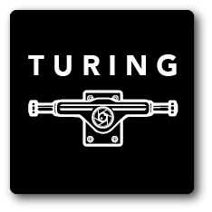

# The Turing Board ⚡️

[Remote Control 🕹](https://turingboard.netlify.com)

<p align="center">
  
</p>

The Turing Board is a concept autonomous longboard that is able to exhibit self-driving capabilities using computer vision. This repository contains code for the webapp that will control the board and display other information.

## Usage

### Dependencies

After you have cloned this repository, run the following commands to install the required dependencies:

```
npm install
```
